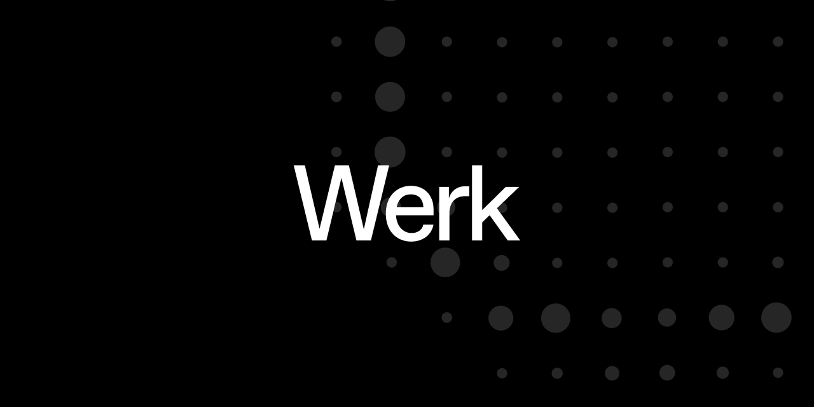

<h1 align="center">Werk Contracts</h1>

<p align="center">
    <strong>Smart contracts built for the Werk platform.</strong>
</p>

<p align="center">
    <a href="https://github.com/xWerk/contracts/actions?query=workflow%3Atest">
        
    </a>
     <a href="https://getfoundry.sh/">
        
    </a>
    <a href="https://x.com/WerkSocial">
        
    </a>
    <a href="https://discord.com/invite/yTcSdN2uCN">
        
    </a>
</p>

<p align="center">
    <a href="https://x.com/WerkSocial">
        
    </a>
</p>

Werk aims to offer a decentralised platform for freelancers and small companies to run all their operations leveraging
the power of web3 as an organisation.

## Architecture

At its core, the Werk protocol enables users to create Space accounts, which serve as vaults for depositing ERC-20
tokens and native tokens (ETH). These accounts are flexible and can be extended to meet the evolving needs of users. A
Space is built on the ERC-4337 standard, leveraging the benefits of the Account Abstraction ecosystem. This architecture
allows Space accounts to execute arbitrary code through enabled modules. This capability endows the Werk protocol with a
modular and extensible framework. It also creates opportunities for an open market of modules, where external developers
can design and integrate their own use cases into the protocol, fostering innovation and expanding the ecosystem.

A module must first be allowlisted through the `ModuleKeeper` before being made publicly available to Werk users.
Currently, due to the high-security risks, only the Werk team can add modules to or remove them from the allowlist.

Once a module is allowlisted, it can be enabled via the `enableModule()` method available on any `Space` account.

### Payment Module

Our first available module is called `PaymentModule`. This module enables users to create on-chain payment requests that
can be paid in any ERC-20 token or native ETH using various methods, such as transfer,
[linear](https://docs.sablier.com/concepts/protocol/stream-types#lockup-linear) or
[tranched](https://docs.sablier.com/concepts/protocol/stream-types#lockup-tranched) stream.

The `PaymentModule` relies on the [Sablier Lockup](https://docs.sablier.com/concepts/lockup/overview) protocol for
stream creation and management.

### Compensation Module

In contrast to the PaymentModule, where an employee or contractor creates a payment request that must be approved and
paid by the employer, the `CompensationModule` introduces a new paradigm that allows employers (companies or business
owners) to create and stream compensation plans directly to their employees.

A compensation plan can be composed by multiple components such as a base salary, token ESOP or other bonuses.

The `CompensationModule` relies on the [Sablier Flow](https://docs.sablier.com/concepts/flow/overview) protocol for
stream creation and management.

### ENS Subdomains

Werk protocol provides a peripheral module called `WerkSubdomainRegistrar` that allows users to register ENS subdomains
for their `Space` accounts. This feature enables users to easily manage and reference their `Space` accounts using
familiar domain names.

## Install

Install Werk contracts using your favourite package manager:

```bash
bun install
```

## Contribute

Anyone is welcomed to contribute either by creating & proposing a new module or simply
[opening](https://github.com/werk/contracts/issues/new) an issue, starting a discussion or submitting a PR.

If you want to propose a new module, fork this repository and create a new folder inside the `src/modules/[module-name]`
folder following the `src/modules/invoice-module` module structure. Then, create a new PR with the module logic and a
detailed description of its capabilities.

## License

The primary license for Werk contracts is the GNU General Public License v3.0 (`GPL-3.0-or-later`),
see [LICENSE](https://github.com/werk/contracts//blob/main/LICENSE). However, many files in `test/` are unlicensed.
